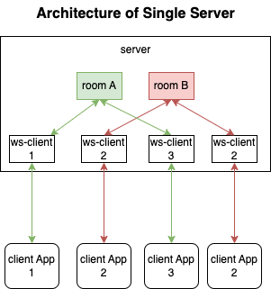
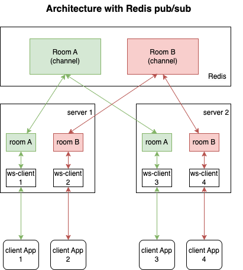

# Chatroom

## API
### Websocket Endpoint
`ws://localhost:8000/ws`

### Get Room List
GET `http://localhost:8000/rooms`

## basic room
- [model/room-basic.go](./model/room-basic.go)

### How to run ?
1. `make start-server`
2. `make start-client`

### Limitations
- a room only visible to 1 server (not scalable)
- a room can send messages to clients on same server.

## scaling with [Redis Pub/Sub](https://redis.io/docs/manual/pubsub/)
- [model/room-pubsub.go](./model/room-pubsub.go)

### Features
- scaling: a room can be on multiple servers
- pubsub: a room can publish / subscribe to different clients connecting to different servers.

### How to run ?
1. `make start-redis` 
2. `make start-server-pubsub` (server1, to localhost `8000`)
3. open new ternminal, `make start-server-pubsub2` (server2, to localhost `8001`)
4. open new ternminal, `make start-client` (to server1)
    - create a room with `name`
5. open new ternminal, `make start-client2` (to server2)
    - join the same room created by step #4

### Reset Database 
`make reset`